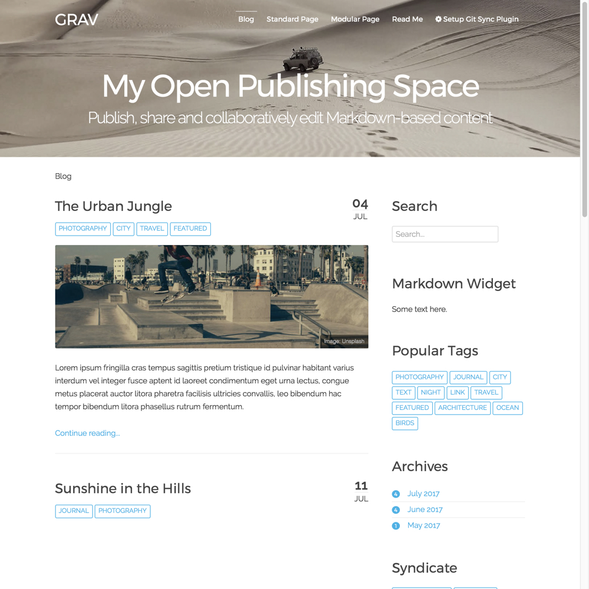

# Open Publishing Space Skeleton



This skeleton uses the [Antimatter Open Publishing theme](https://github.com/hibbitts-design/grav-theme-antimatter-open-publishing), a customized version of the [Antimatter theme](https://github.com/getgrav/grav-theme-learn2).

### Standard Antimatter Features

* Lightweight and minimal for optimal performance
* Fully responsive with off-page mobile navigation
* SCSS based CSS source files for easy customization
* Built-in support for on-page navigation
* Multiple page template types
* Fontawesome icon support

### Additional Open Publishing Features

* 'Chromeless' page display (i.e. only display page content)
* Integrated support for Git Sync (i.e. view/edit pages in GitHub)
* Markdown sidebar
* Featured posts (i.e. sticky posts)
* Custom menu items
* Option to toggle page summaries (i.e. summaries are not displayed with page content)
* Creative Commons license

### Supported Page Templates

* Default view template
* Blog view template
* Error view template
* Blog item view template
* Modular view templates:
  * Features Modular view template
  * Showcase Modular view template
  * Text Modular view template
* SnipCart view template

### Menu Features

##### Dropdown Menu

You can enable **dropdown menu** support by enabling it in the `antimatter.yaml` configuration file. As per usual, copy this file to your `user/config/themes/` folder (create if required) and edit there.

```
dropdown:
  enabled: true
```

This will ensure that sub-pages show up as sub-menus in the navigation.

##### Menu Text & Icons

Each page shows up in the menu using the title by default, however you can set what displays in the menu directly by setting an explicit `menu:` option in the page header:

```
menu: My Menu
```

You can also provide an icon to show up in front of the menu item by providing an `icon:` option.  You need to use name of the FontAwesome icon without the `fa-` prefix.  Check out the full [list of current FontAwesome 4.2 icons](http://fortawesome.github.io/Font-Awesome/icons/):

```
icon: bar-chart-o
```

### Blog Features

##### Daring Fireball Link Pages

Antimatter Open Publishing supports the ability for a page to have a `link:` header option.  This will then in turn create a **link page** where the title of the page will actually be linked to the link provided and a prefexid double angle `>>` will link to the page itself.  Simply provide the link in the page header:

```
link: http://getgrav.org/blog
```

### Page Header Options
All pages support the following additional options:
```
hide_git_sync_repo_link: true  # hide Git Sync link for this page
git_sync_repo_link: https://github.com/hibbitts-design/grav-skeleton-course-hub/tree/master/pages/01.home   # to override the automatically calculated GitHub URL
```

### Theme Options


## Basic Setup for a New Grav Site

The simplest way to install the Antimatter Open Publishing theme with sample content for Grav is to download and install the Open Publishing Space Skeleton package:

1. [Download Open Publishing Space Skeleton](http://getgrav.org/downloads/skeletons#extras)
2. Unzip the package into your web root folder.
3. Point your browser at the folder.
4. Job done!

**TIP:** Check out the [general Grav Installation Instructions](http://learn.getgrav.org/basics/installation) for more details on this process.

---
